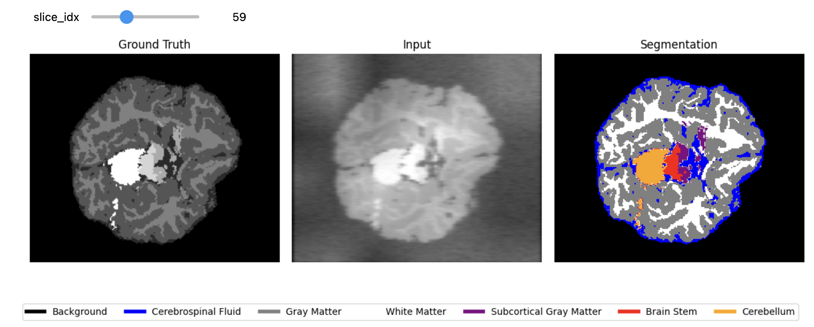
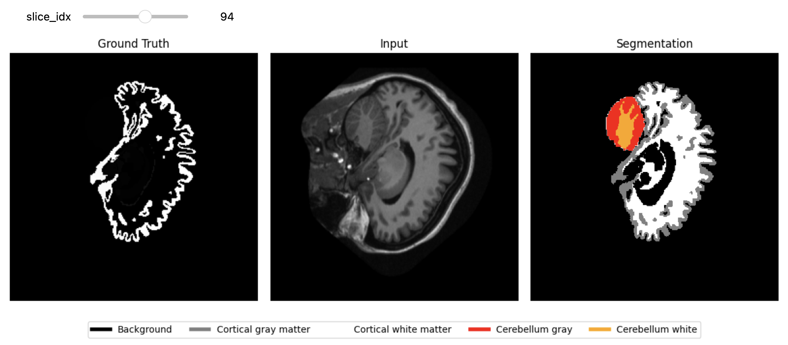
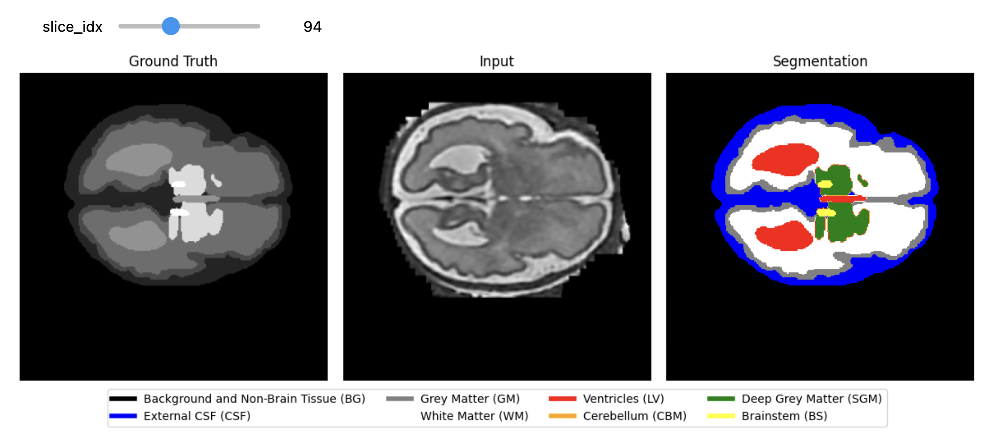

# Deep-Neurosegmentation
A Deep Learning framework to perform NeuroImaging with a Semi-Supervised Learning approach.





## Useful Links
- [Project guideline](https://docs.google.com/document/d/1340JOV0JsvpCUIeUQ3j8jZcAGy1AWgKJdzz6PUAPiP8/edit)
- [Overleaf](https://www.overleaf.com/4649694261cykwdxrwpjjc#cf931c)


## MindBoggle Dataset

Mindboggle is a dataset that contains 101 annotated brain images and segmentations. The dataset is available on the [MindBoggle website](https://mindboggle.info/data). Considered the gold standard.


### Legend


## DBB Dataset

The DBB dataset is a set of 954 subjects, is detailed in [this article](https://www.sciencedirect.com/science/article/pii/S1053811922006024).

### Dataset Overview
- The dataset includes typically developing cohorts of children and adolescents. The raw image data for these cohorts is not publicly shared. However, we include one of the cohorts (NIHPD), identifiable through the DBB.csv file.

Data augmentation has been applied to labels and synthetic brain images to generate paired outputs, creating three iterations for a more extensive training dataset.

### References


### Legend
```
  - 0 = background
  - 1 = cerebrospinal fluid
  - 2 = gray matter
  - 3 = white matter
  - 4 = subcortical gray matter
  - 5 = brain stem
  - 6 = cerebellum
```
## FeTA Dataset

The Fetal Tissue Annotation (FeTA) Challenge dataset is the training dataset for the FeTA Challenge held at the MICCAI Conference. The dataset consists of T2-weighted fetal brain super-resolution reconstructions and the associated manually-created label map consisting of seven different tissues:
```
0. Background and non-brain tissue
1. Cerebrospinal fluid
2. Grey Matter
3. White Matter
4. Ventricles
5. Cerebellum
6. Deep Grey Matter
7. Brainstem
```
### Dataset Overview

The goal of this dataset is to encourage research groups to create automatic multi-class segmentation methods to segment the fetal brain across a range of gestational ages and a variety of brain pathologies as well as normally developing fetal brains.

### Terms of Use

Access to the data requires that you are a registered Synapse user and agree to the following terms and conditions:
```
1. Fetal Tissue Annotation Challenge Dataset shall be used only for research and education purposes.
2. By joining the FeTA dataset users team, you acknowledge that the owner of the Fetal Tissue Annotation Challenge Dataset is the University Children’s Hospital Zurich.
```
See [feta.grand-challenge.org](https://feta.grand-challenge.org) for more details and to register for the FeTA Challenge.

### References

If you use this dataset, please cite the following:

Payette, K., de Dumast, P., Kebiri, H. et al. An automatic multi-tissue human fetal brain segmentation benchmark using the Fetal Tissue Annotation Dataset. Sci Data 8, 167 (2021). [https://doi.org/10.1038/s41597-021-00946-3](https://doi.org/10.1038/s41597-021-00946-3)

### Legend
```
- 0 = Background and Non-Brain Tissue (BG)
- 1 = Extra-axial CSF (CSF)
- 2 = Gray Matter and developing cortical plate (GM)
- 3 = White Matter and subplate (WM)
- 4 = Lateral ventricles (LV)
- 5 = Cerebellum (CBM)
- 6 = Thalamus and putamen (SGM)
- 7 = Brainstem (BS)
```
### Additional Information

- **Pathology**: 
  - Description: Presence of fetal pathology
  - Levels: 
    - Pathological: Fetal pathology
    - Neurotypical: Fetus with no apparent neurodevelopmental malformation

- **Gestational Age**: 
  - Description: Gestational age of the fetus
  - Units: Weeks

### Metadata

- **Name**: Fetal Tissue Annotation Challenge FeTA Dataset
- **BIDSVersion**: 1.6.1
- **DatasetType**: Derivative
- **License**: KISPI License
- **Authors**: Kelly Payette, Andras Jakab
- **Acknowledgements**: Special thanks to the data contributors, annotators and the contributors of the initial benchmarks on the FeTA dataset: Priscille Guerrier de Dumast, Hamza Kebiri, Ivan Ezhov, Johannes Paetzold, Suprosanna Shit, Asim Iqbal, Romesa Khan, Raimund Kottke, Patrice Grehten, Hui Ji, Levente Lanczi, Marianna Nagy, Monika Beresova, Thi Dao Nguyen, Giancarlo Natalucci, Theofanis Karayannis, Bjoern Menze, Meritxell Bach Cuadra
- **HowToAcknowledge**: Please cite our Preprint: Payette et al. (2020) A comparison of automatic multi-tissue segmentation methods of the human fetal brain using the FeTA Dataset; or the paper after publication. ArXiv
- **Funding**: EMDO Foundation, OPO Foundation, Prof. Dr. Max Cloetta Foundation, FZK (Forschungszentrum für das Kind) Grant, Anna-Mueller-Grocholski Foundation, ZNZ PhD Grant
- **EthicsApprovals**: Mothers of the healthy fetuses participating in the respective research studies were prospectively informed about the study by members of the research team and gave written consent for their participation. Mothers of fetuses with pathology included in the current work were scanned as part of their routine clinical care and gave informed written consent for the re-use of their data. The ethical committee of the Cantone of Zürich approved the prospective and retrospective studies that collected and analysed the MRI data (Decision numbers: 2017-00885, 2016-01019, 2017-00167), and a waiver for an ethical approval was acquired for the release of an irreversibly anonymized dataset.


## Environment
To create the environment `neurosegmentation`, run the following command:
```bash
conda create -n neurosegmentation python=3.9
```

To activate the environment, run the following command:
```bash
conda activate neurosegmentation
```

To install Pytorch, run the following command:
```bash
conda install pytorch torchvision torchaudio pytorch-cuda=11.8 -c pytorch -c nvidia
```
Install `nnunetv2` with:

```bash
pip install nnunetv2
```

## Creation of the config file

Several python scripts access the directories of the data. To avoid hardcoding the paths, we use a config file that contains all the paths.

To create the config file `config.ini` that will be useful to get all directories, use the command:
```bash
python create_config.py
```

Note: It's possible that there is an error, and you are asked to install other libraries such as `tqdm` or `nibabel`. Install the required libraries, I will release the full environment soon.

# Data Preparation

To prepare the directory structure for your data, run the `setup_data_processed.py` script. This script creates the necessary subdirectories within the `data/processed` folder.

## Usage

### Creating Directories

Before switching to the nnunet, I advise to use the following data structure:

```bash
data/
├── raw/
│   ├── dataset_1/
│   └── dataset_2/
└── processed/
│   ├── dataset_1/
│   │   ├── ground_truth/
│   │   ├── input/
│   │   └── segmentation/
│   ├── dataset_2/
│   │   ├── ground_truth/
│   │   ├── input/
│   │   └── segmentation/
```
- `raw`: You can place your raw data in this directory.
- `processed`: You should move your processed data to this directory.
- `processed/dataset_1/ground_truth`: Directory for ground truth data. This is often continuous data, and needs some processing before it can be used a segmentation target (which has a finite set of integer classes)
- `processed/dataset_1/input`: Directory for input data (for example T1, T2 scans)
- `processed/dataset_1/segmentation`: Directory for segmentation data. This is often discrete data, and can be used as a segmentation target.


# nnUNet

Now we can switch to the nnUNet framework to train and evaluate the models.

## Guideline on the Data Structure Conventions

The nnUNet framework requires a specific naming convention for the files. This guideline provides the necessary structure and naming conventions to follow. As of 2024-05-15, the guidelines are as follows:

### Folder Structure

There are three main folders:

- `nnUNet_raw`: Contains the raw data.
- `nnUNet_preprocessed`: Contains the preprocessed data.
- `nnUNet_results`: Contains the results of the nnUNet model.

Within the `nnUNet_raw` folder, datasets are identified by a number:
```
- `1` for MindBoggle
- `2` for DBB
- `3` for DBB_augmented
- `4` for Feta
```
Each dataset folder should have the following structure:

```bash
nnUNet_raw/
├── dataset_1/
│   ├── imagesTr/
│   ├── imagesTs/
│   ├── labelsTr/
└── dataset_2/
    ├── imagesTr/
    ...
```

Naming Convention
Within the imagesTr folder, filenames must follow a strict naming convention:

file_name_patient_id_modality_id

`Examples:`

mindboggle_0010_0000.nii.gz

Subject ID: 10
Modality: 0 (usually T1)
mindboggle_0010_0001.nii.gz

Subject ID: 10
Modality: 1 (for example, T2)
mindboggle_0011_0000.nii.gz

Subject ID: 11
Modality: 0 (T1)
For more detailed and updated guidelines, please check the nnUNet GitHub repository:


## Helper functions

To save you time, I have created a script that will help you set up the nnUNet data structure with the `nnunet/setup_nnunet.py` script.

By default, the script will setup the MindBoggle, DBB, and Feta nnUNet structure from the `data/processed` folder.

```bash
python setup_nnunet.py
```

If you want to setup only chosen datasets (for example mindboggle and dbb), you can use the following command:

```bash
python setup_nnunet.py --mindboggle --dbb
```

By default, the script will not overwrite. If you want to forcefully overwrite the structure, you can use the `-o` or `--overwrite` flag:

```bash
python setup_nnunet.py -o
```

Or if you want to overwrite a specific dataset:

```bash
python setup_nnunet.py --mindboggle --dbb -o
```

## Setting up the environment variables for nnunet

Before running the nnUNet commands, you need to set up the environment variables.
Indeed, the `nnUNet` regularly checks some environment variables to get the paths to the raw, preprocessed, and results directories.

To setup the environment variables, run the following commands:

```bash
export nnUNet_raw=/rds/project/rds-7tts6phZ4tw/deep-neurosegmentation/nnunet/nnUNet_raw

export nnUNet_preprocessed=/rds/project/rds-7tts6phZ4tw/deep-neurosegmentation/nnunet/nnUNet_preprocessed

export nnUNet_results=/rds/project/rds-7tts6phZ4tw/deep-neurosegmentation/nnunet/nnUNet_results
```


These variables have been setup by the `setup_nnunet.py` script just before. If you change the location of the folder, the updated values are in the `config.ini` 

(Optional): To check if the environment variables have been set up correctly, run the following command:
```bash
echo $nnUNet_raw
echo $nnUNet_preprocessed
echo $nnUNet_results
```

(Optional): These variables are temporary and will be lost when you close the terminal. If you want to keep these variables, you can add them to your `.bashrc` or `.bash_profile` file, and each time you open a terminal, they will be set up automatically. To do this, run the following commands:

```bash
echo "export nnUNet_raw=/rds/project/rds-7tts6phZ4tw/deep-neurosegmentation/nnunet/nnUNet_raw" >> ~/.bashrc
echo "export nnUNet_preprocessed=/rds/project/rds-7tts6phZ4tw/deep-neurosegmentation/nnunet/nnUNet_preprocessed" >> ~/.bashrc
echo "export nnUNet_results=/rds/project/rds-7tts6phZ4tw/deep-neurosegmentation/nnunet/nnUNet_results" >> ~/.bashrc
```

## Plan and Process for nnUNet

Now that your data has been set up in the right format (`.nii` or` .nii.gz` files), you still need to prepare them to be compatible for the `nnUNetv2` format.

You can run the following command, where you repace `DATASET_ID` with the corresponding dataset id.

```
nnUNetv2_plan_and_preprocess -d DATASET_ID --verify_dataset_integrity
```

The format I am using is:
```bash
- 1: MindBoggle
- 2: DBB
- 3: DBB_augmented
- 4: Feta
```

Example with MindBoggle:
- I replace -d with 1 for the MindBoggle associated id.
- I also add `-c 3d_fullres` because I only use the 3D CNN, no need to train the 2D cnn nor the cascade.

```bash
nnUNetv2_plan_and_preprocess -d 1 --verify_dataset_integrity -c 3d_fullres
```

## Training nnUNet

To train the nnUNet model, you can send a SLURM job with the `train_model.sh` script in the `./cluster_scripts` folder.

You can run the following command:

```bash
cd cluster_scripts
sbatch train_model.sh
```

By default: the `train_model.sh` script will train the model on the MindBoggle dataset with the 3d_fullres network and all folds.

You should edit this file to train on the dataset you want. 

Here are the guidelines:

This `train_model.sh` bash script will call the `nnUNetv2_train` command with the corresponding dataset, network, and fold.

The general command is:

```bash
nnUNetv2_train DATASET_ID NETWORK FOLD
```

Example:
On the MindBoggle dataset, with the 3d_fullres network and training on all data:
```bash
nnUNetv2_train 1 3d_fullres all
```

If you want to save the softmax outputs during the final validation (useful for ensembling or detailed analysis), you can add the --npz flag:

```bash
nnUNetv2_train 1 3d_fullres all --npz
```

## Inference with nnUNet

To perform inference with nnUNet, you can run the following command:

```bash
nnUNetv2_predict -i INPUT_FOLDER -o OUTPUT_FOLDER -d DATASET_ID -c CONFIGURATION
```

If you want to save the probabilities:

```bash
nnUNetv2_predict -i INPUT_FOLDER -o OUTPUT_FOLDER -d DATASET_ID -c CONFIGURATION --save_probabilities
```

Example:
With the MindBoggle dataset (dataset ID 1) and 3D full resolution U-Net:

```bash
nnUNetv2_predict -i /path/to/input_folder -o /path/to/output_folder -d 1 -c 3d_fullres --save_probabilities
```

## Evaluation with nnUNet

The general command for evaluation is:

```bash
nnUNetv2_evaluate_folder -ref REFERENCE_FOLDER -pred PREDICTION_FOLDER -json OUTPUT_JSON -use_labels LABELS
```

Example with MindBoggle dataset (dataset ID 1):

```bash
nnUNetv2_evaluate_folder -ref /path/to/reference_folder -pred /path/to/prediction_folder -json /path/to/output.json -use_labels 1 2 3 4 5 6
```
